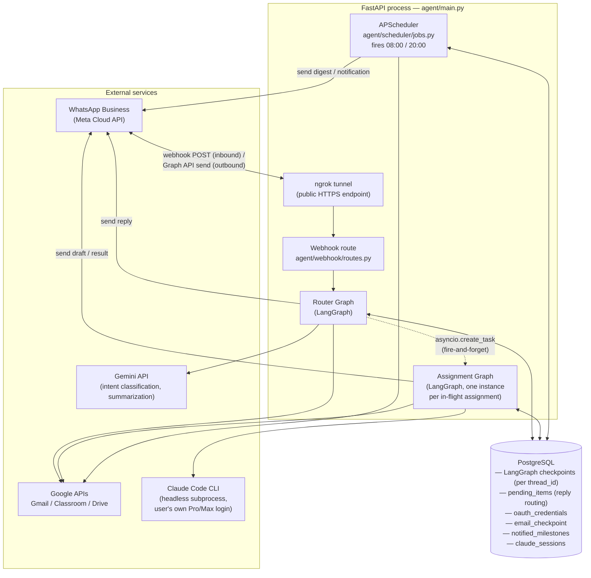
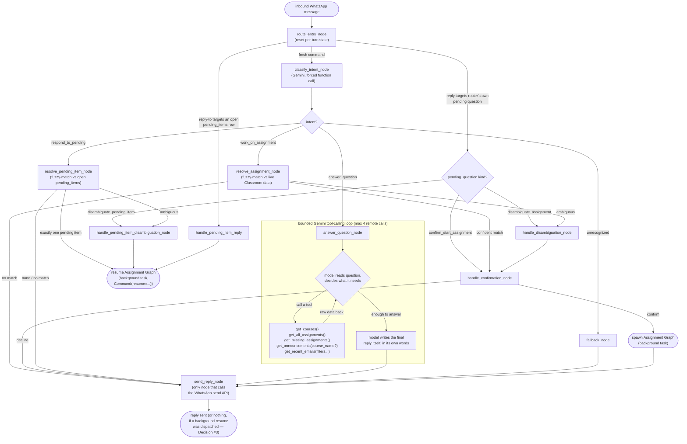
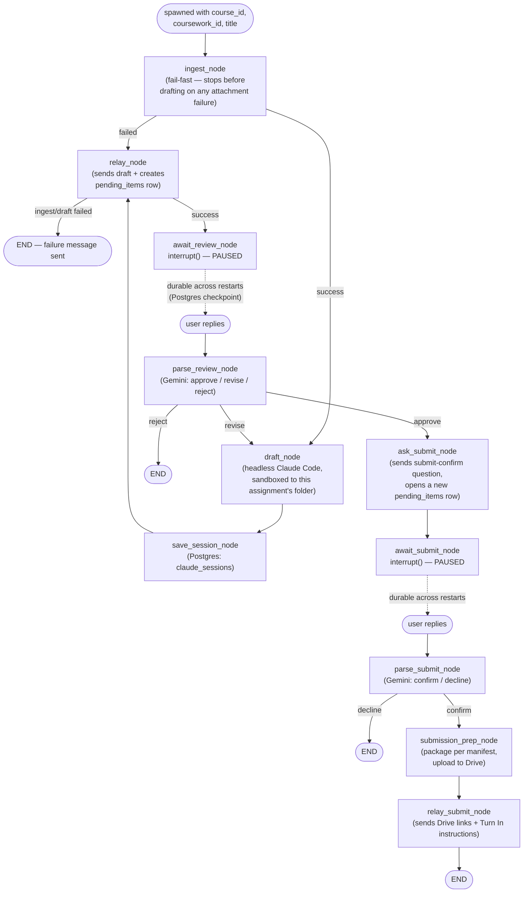

# Architecture

Diagrams of the system as it's actually built today. See `CLAUDE.md` for
the prose version and `docs/product_definition.md` for behavior/permission
rules.

## 1. High-level system architecture

One long-running process with two independent halves — a webhook path that
answers on-demand messages, and a scheduler that proactively checks Gmail
and Classroom. Both share the same Postgres pool, Google API clients, and
WhatsApp-send helper.

**Why it's split this way:** proactive checks are always read-only and
never need approval, so they deliberately bypass LangGraph entirely —
plain async functions, not graph nodes. Everything that can *write*
(send email, submit an assignment) only ever happens inside the LangGraph
graphs, gated behind explicit `interrupt()` approval pauses.

## 2. Router graph — as implemented today

Thread ID: `user:<whatsapp-number>`. One instance, long-lived, handles
every on-demand command.

Note the two different "spawn" edges: confirming "work on X" starts a
**brand-new** assignment-graph thread; resolving a reply to something
already in flight **resumes** an existing paused one via
`Command(resume=...)`. Either way it's dispatched as a detached
`asyncio.create_task`, tracked in `app.state.background_tasks` so it
survives being referenced only locally — the router returns immediately
either way, keeping the webhook fast regardless of how long drafting takes.

`answer_question_node` replaces what used to be separate `classroom_node`/
`gmail_node` handlers wired to fixed intents (`list_courses`/`whats_due`/
`summarize_emails`/`search_emails`) with a single bounded Gemini
tool-calling loop (spec: `specs/tool-calling-read-answers.md`) — the model
calls `get_courses`/`get_all_assignments`/`get_missing_assignments`/
`get_announcements`/`get_recent_emails` itself, gets raw data back, and
writes its own reply instead of picking from a fixed set of canned
formatters. This fixed two real bugs hit during live testing: "what's
due" used to default to a hardcoded 48-hour window, silently dropping an
assignment due further out; "latest announcement" had no matching intent
at all and fell through to Gmail search. `work_on_assignment` and
`respond_to_pending` are unaffected — they stay deterministic,
classification-routed state-machine transitions (Decision #5 in the spec),
not free-form Q&A, since they trigger side effects (dispatching a
background graph run) rather than just producing an answer.

## 3. Assignment graph — as implemented today

Thread ID: `assignment:<course_id>:<coursework_id>`. One instance per
assignment; multiple can be paused at their own `interrupt()` simultaneously.

The two `interrupt()` calls are the actual pause points — LangGraph
suspends real execution there, and the Postgres checkpoint is the only
thing keeping that state alive. That's what makes an approval survive a
process restart: a crash after "Starting on X…" but before the draft is
ready is not recoverable this way (still executing, no checkpoint to
resume from) — a crash *after* the draft was sent, while waiting on your
"approve"/"revise" reply, is fully recoverable.

## Thread-ID summary

| Graph | Thread ID pattern | Lifetime |
|---|---|---|
| Router | `user:<whatsapp-number>` | One per user, effectively permanent |
| Assignment | `assignment:<course_id>:<coursework_id>` | One per assignment, from "work on X" to terminal (reject/decline/submit) |
| Email-draft | `email:<uuid>` | **Not implemented yet** — scaffold only |
